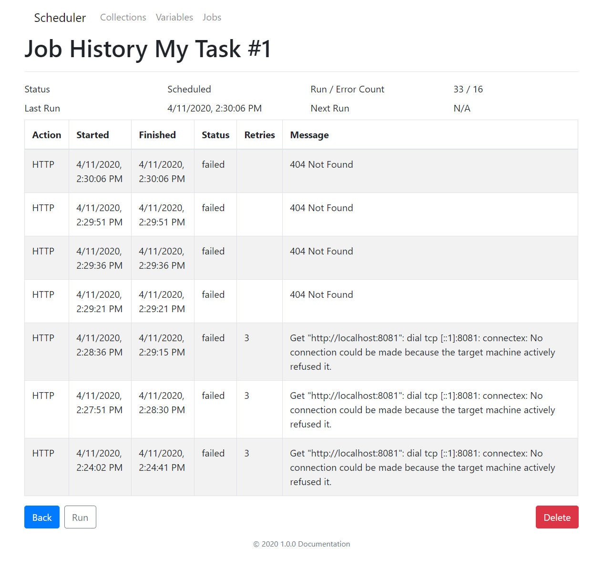

# Scheduler

[](https://travis-ci.org/akornatskyy/scheduler)

The scheduler is a fully managed cron job scheduler. It allows you to schedule
virtually any job (e.g. such as calling HTTP/S endpoints). You can automate
everything, including retries in case of failure, run jobs right away, on a
recurring schedule, or at some point in the future.

The scheduler allows you to manage all of your automation tasks in a single place
via simple UI or command line.

If you’re using this service, **★Star** this repository to show your interest,
please!

## Screenshots

| Collections Page                                             | Jobs Page                                                    |
| ------------------------------------------------------------ | ------------------------------------------------------------ |
|  |        |
| Job Page                                                     | Job History Page                                             |
|          |  |

## Service Architecture

Scheduler Microservice is composed of scheduler service (HTTP API and SPA
UI) that uses Postgres for persistence. The service part (HTTP, RESTful API,
JSON) is written in Go, UI part is in Node.js (SPA, ES6, react, webpack).
Packaged into a docker image and orchestrated by Kubernetes.


The service contains stateless parts (API) and stateful part (job scheduler
and Postgres notification events subscriber).

There is Open API service [specification](./openapi.yaml)
published [online](https://akornatskyy.github.io/scheduler).

The stateful part scales out by subscribing to Postgres notification events
and refecting corresponding changes in job scheduler. The job scheduler
ensures that only one job is run at a given point of time (although each
instance has a full list of enabled jobs and competes to acquire one).

## Installation

There are several installation methods:

1. Running locally.
2. Running with Docker Compose.

> 💡 The services does not automatically apply SQL schema. You need to manually
> connect to your Postgres database and run
> [sql scripts](./misc/db).

### Option 1: Running locally

If you are going to play around first or contribute you might consider to
run service locally.

```sh
# default data source name
export DSN=postgres://postgres:@127.0.0.1:5432/postgres?sslmode=disable
```

> NOTE: Apply apply [sql scripts](./misc/db) per connection
> DSN environment variable.

```sh
npm run build
go build
```

The  `npm build` places SPA resources into `static` directory and service
can serve files out of it. In this case, just start service executable and
navigate to http://localhost:8080.

Alternatively, you can run via `npm start` (enables hot reloading) and
navigate to http://localhost:3000.

### Option 2: Running with Docker Compose

You can use automatically built Docker
[image](https://hub.docker.com/r/akorn/scheduler) from Docker Hub and start
service right away.

```sh
cd misc/docker
docker-compose up -d
```

View output from containers with `docker-compose logs -f --tail=10`.

> NOTE: The DB is exposed on port *5432* of your docker machine. You need
> manually apply [sql scripts](./misc/db).

The service frontend should be available on port *8080* of your docker machine.

For more information refer to files at the
[`misc/docker`](./misc/docker) directory.

### Cleanup

If you have deployed the application with docker compose, you can stop and
remove containers with `docker-compose down`.
