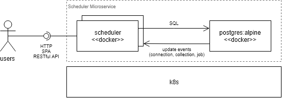

# Scheduler

The scheduler is a fully managed cron job scheduler. It allows you to schedule
virtually any job (e.g. such as calling HTTP/S endpoints). You can automate
everything, including retries in case of failure, run jobs right away, on a
recurring schedule, or at some point in the future.

The scheduler allows you to manage all of your automation tasks in a single place
via simple UI or command line.

If you’re using this service, **★Star** this repository to show your interest,
please!

## Screenshots

| Collections Page                                             | Jobs Page                                                    |
| ------------------------------------------------------------ | ------------------------------------------------------------ |
|  |        |
| Job Page                                                     | Job History Page                                             |
|          |  |

## Service Architecture

Scheduler Microservice is composed of scheduler service (HTTP API and SPA
UI) that uses Postgres for persistence. The service part (HTTP, RESTful API,
JSON) is written in Go, UI part is in Node.js (SPA, ES6, react, webpack).
Packaged into a docker image and orchestrated by Kubernetes.

The service contains stateless parts (API) and stateful part (job scheduler
and Postgres notification events subscriber).

There is Open API service [specification](./blob/master/openapi.yaml)
published [online](https://akornatskyy.github.io/scheduler).

The stateful part scales out by subscribing to Postgres notification events
and refecting corresponding changes in job scheduler. The job scheduler
ensures that only one job is run at a given point of time (although each
instance has a full list of enabled jobs and competes to acquire one).
