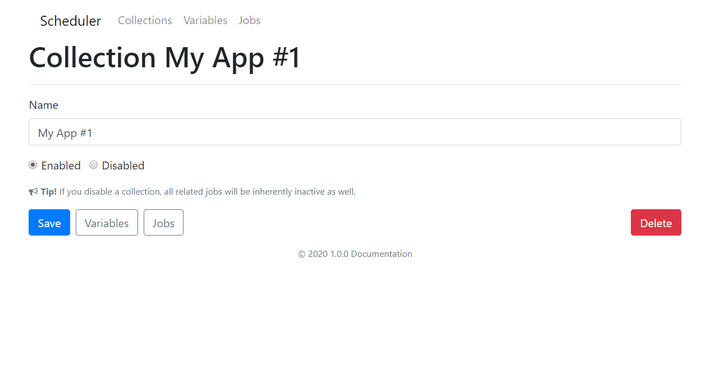
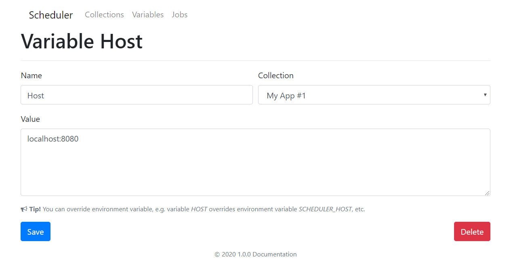
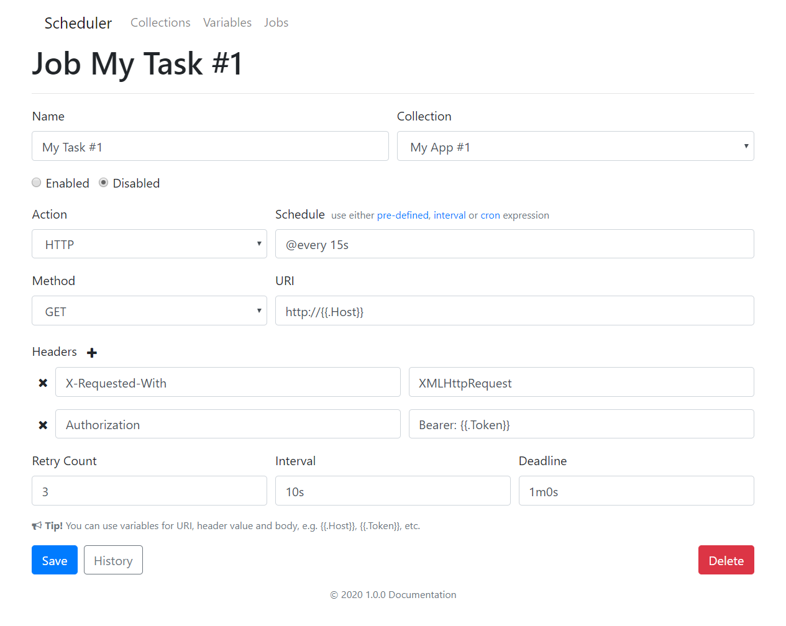
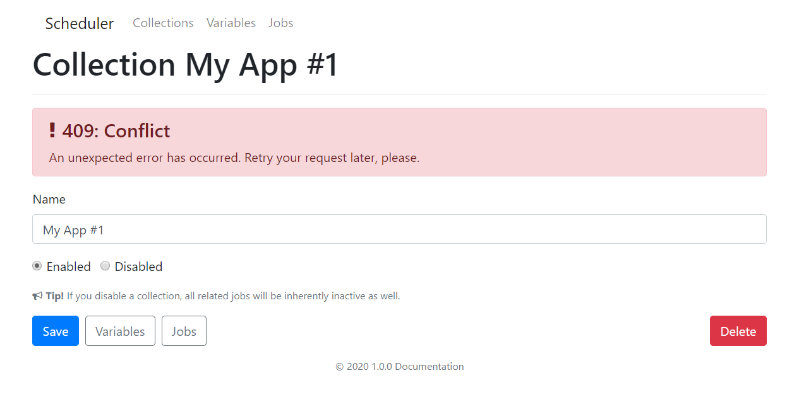
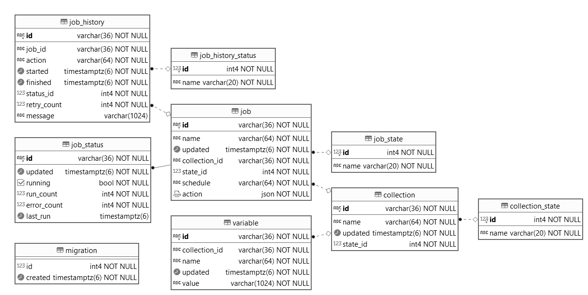

# Clappnet Notes
- 3 services are running on this server: postgresql, scheduler and pgadmin4
- Postgressql: postgres/postgres
- Scheduler: http://[server-ip]:8080/ (no auth required)
- pgadmin4: http://[server-ip]/pgadmin4/ (ekt@clappnet.com/54321qwert)

# Scheduler

[](https://github.com/akornatskyy/scheduler/actions/workflows/tests.yaml) [](https://coveralls.io/github/akornatskyy/scheduler?branch=master)

The scheduler is a fully managed cron job scheduler. It allows you to schedule
virtually any job (e.g. such as calling HTTP/S endpoints). You can automate
everything, including retries in case of failure, run jobs right away, on a
recurring schedule, or at some point in the future.

The scheduler allows you to manage all of your automation tasks in a single place
via simple UI or command line.

This service works on any Kubernetes cluster (such as Minikube), it’s easy to
deploy with little to no configuration.

If you’re using this service, **★Star** this repository to show your interest,
please!

## Screenshots

| Collections Page                                             | Collection Details Page                                      |
| ------------------------------------------------------------ | ------------------------------------------------------------ |
|  |  |
| **Variables Page**                                           | **Variable Details Page**                                    |
|  |  |
| **Jobs Page**                                                | **Job Details Page**                                         |
|        |  |
| **General Error Page**                                       | **Job History Page**                                         |
|  |  |

## Service Architecture

Scheduler Microservice is composed of scheduler service (HTTP API and SPA
UI) that uses Postgres for persistence. The service part (HTTP, RESTful API,
JSON) is written in Go, UI part is in Node.js (SPA, ES6, react, webpack).
Packaged into a docker image and orchestrated by Kubernetes.


The service contains stateless parts (API) and stateful part (job scheduler
and Postgres notification events subscriber).

There is Open API service [specification](./openapi.yaml)
published [online](https://akornatskyy.github.io/scheduler).

The stateful part scales out by subscribing to Postgres notification events
and refecting corresponding changes in job scheduler. The job scheduler
ensures that only one job is run at a given point of time (although each
instance has a full list of enabled jobs and competes to acquire one).

### Database Schema



## Installation

There are several installation methods:

1. Running locally.
2. Running with Docker Compose.
3. Running on Kubernetes.

> 💡 The service automatically migrates SQL schema.

### Option 1: Running locally

If you are going to play around first or contribute you might consider to
run service locally.

```sh
# default data source name
export DSN=postgres://postgres:@127.0.0.1:5432/postgres?sslmode=disable
```

```sh
npm run build
go build
```

The  `npm build` places SPA resources into `static` directory and service
can serve files out of it. In this case, just start service executable and
navigate to http://localhost:8080.

Alternatively, you can run via `npm start` (enables hot reloading) and
navigate to http://localhost:3000.

### Option 2: Running with Docker Compose

You can use automatically built Docker
[image](https://hub.docker.com/r/akorn/scheduler) from Docker Hub and start
service right away.

```sh
cd misc/docker
docker-compose up -d
```

View output from containers with `docker-compose logs -f --tail=10`.

The service frontend should be available on port *8080* of your docker machine.

For more information refer to files at the
[`misc/docker`](./misc/docker) directory.

### Option 3: Running on Kubernetes

If you are using Minikube to run a Kubernetes cluster locally, start it via
`minikube start`.

Roll out service with  `kubectl apply -f misc/k8s`.

Run `kubectl get pods` to verify the pods are ready and running.

> NOTE: You can expose DB via `kubectl port-forward service/scheduler-db 5432`.

The service can be accessed with `minikube service scheduler`. Use
`minikube dashboard` to access the Kubernetes dashboard running within the
cluster.

### Cleanup

If you have deployed the application with docker compose, you can stop and
remove containers with `docker-compose down`.

If you have deployed the application with `kubectl apply -f misc/k8s`, you can
run `kubectl delete -f misc/k8s` to clean up the deployed resources.

If you have deployed to minikube, stop the cluster with `minikube stop` or
delete virtual machine with `minikube delete`.
